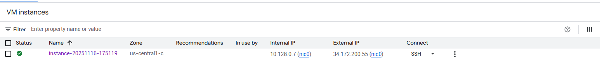
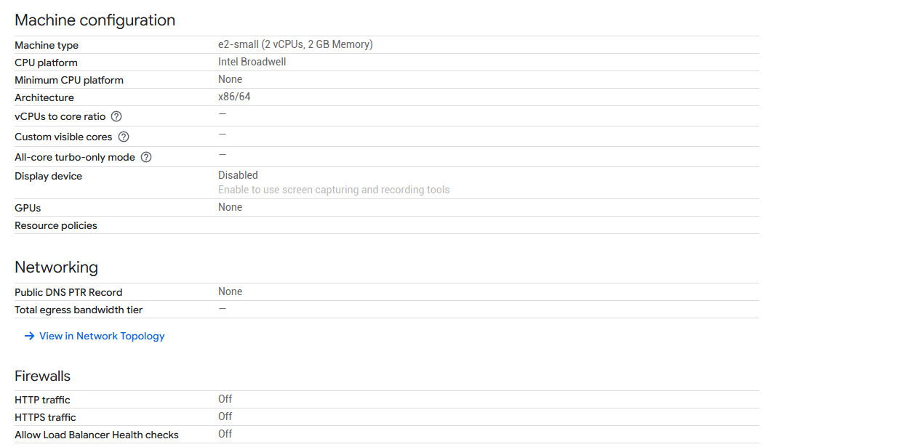
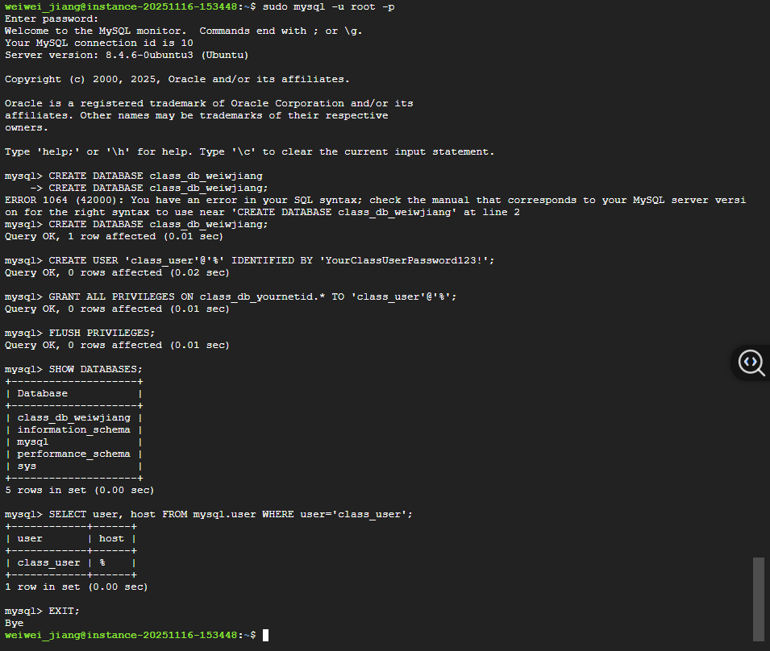
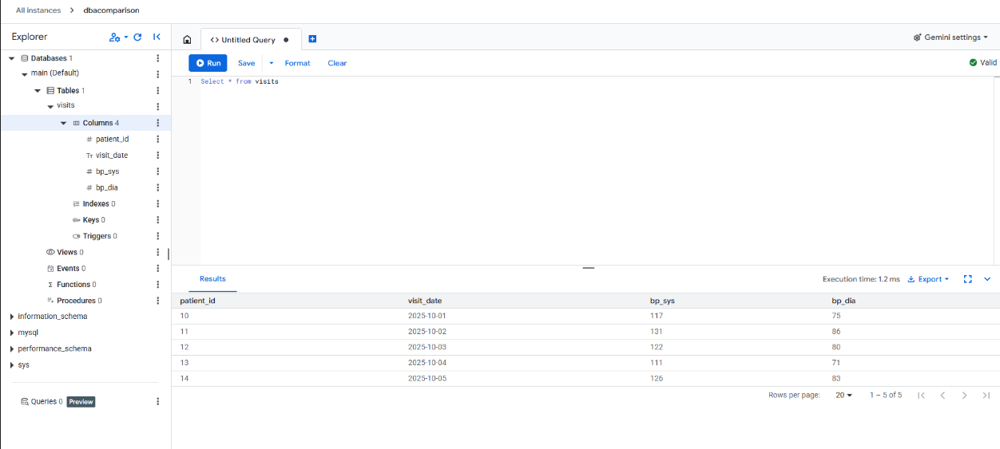

# MySQL comparison between VM(self-managed) and Managed

## Recording
Loom recording <https://www.loom.com/share/6bf3424b9cfc4c339fdfcb416e5d5d3e> and <https://www.loom.com/share/d50e2c1923f34a93bfb87c2c53e8ce9a>
 
## Chosen platform
For this project, I used Google Cloud Platform to set up both the virtual machine and the Cloud SQL database.

## VM
### Creating the VM
1. Begin by establishing a new instance.
2. Choose the E2 family for a nice blend of price and performance.
3. Choose the e2-small option to acquire 2GB of RAM.
4. Select Ubuntu as the operating system.
5. Leave the rest of the settings as they are.

### Setting Up Firewall Rules
1. Add a new firewall rule.
2. Provide a clear name and description.
3. Set the authorized IP range to 0.0.0.0/0 to ensure that the VM can take traffic from anywhere.
4. Allow MySQL traffic on TCP port 3306.

### SSH Configuration Steps:
1. To refresh the package listings, run sudo apt-get update.
2. Install MySQL using sudo apt install mysql-server mysql-client.
3. Run the command sudo mysql to log into MySQL.
4. Create a new MySQL user with the command: CREATE USER 'xxx'@'%' IDENTIFIED BY 'xxx';
5. Grant full privileges with the following command: GRANT ALL PRIVILEGES ON *.* TO 'xxx'@'%' WITH GRANT OPTION.
6. Open the mysqld.cnf file and change the bind address to 0.0.0.0/0 to allow remote connections.
7. Restart the service, then check the connection locally using mysql -u dba -p.
8. Enter the password you assigned.

A .env file can contain the sensitive values.

## Managed Cloud SQL
### Cloud SQL
1. Choose to construct a sandbox MySQL instance.
2. Create an instance name and password.
3. Select a region and then press the Create button.

### Configuration
1. Add the IP address '0.0.0.0/0' to the list of allowed networks.
2. To ensure security, disable SSL-only connections.
3. Create a new user with a username and password.

A .env file can contain the sensitive values.

## Screenshots
### VM
Running VM

VM configuration

SSH connection to MySQL

VM query

### Managed
Running MN cloud SQL

Python script results

MN cloud SQL query

